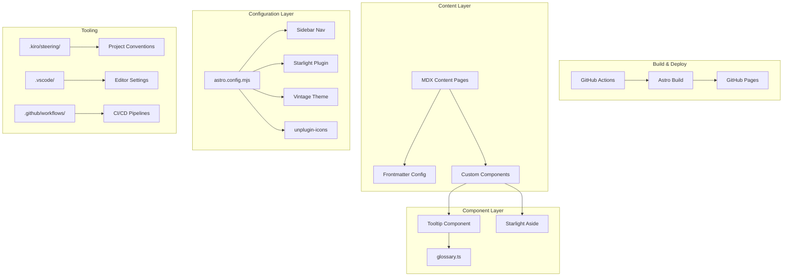

# Design Document

## Overview

This design describes an Astro Starlight documentation site that teaches AWS ECS Express Mode by example. The site documents the `terraform-aws-ecs-express-mode-demo` project — a minimal ECS Express Gateway Service deployment running a Bedrock-powered container with auto scaling, managed ALB, and public HTTPS ingress.

The site uses Astro with `@astrojs/starlight` and the `starlight-theme-vintage` theme plugin, deployed to GitHub Pages via GitHub Actions. Content is authored in MDX with custom components (Tooltip for glossary terms, Aside for callouts) and organized into progressive sections from concepts through deployment and troubleshooting.

Key design decisions:

- **Astro Starlight scaffolding from reference repo** — The base Astro project structure, Starlight configuration, theme setup, GitHub Actions, VSCode config, Kiro steering files, Tooltip component, and glossary pattern are all adapted from `github.com/jajera/s3-vectors-rag-workload`. Only content pages and ECS-specific glossary terms are new.
- **MDX** for content pages to enable custom component usage inline with markdown
- **TypeScript glossary file** as single source of truth for term definitions, consumed by the Tooltip component
- **Draft workflow** using Starlight's native `draft:true` frontmatter to control page visibility
- **GitHub Pages** deployment via the official `withastro/action` for zero-config static hosting
- **Console screenshot placeholders** — Content pages include placeholder images (`![placeholder]`) for AWS console screenshots showing Express Mode in action. These are replaced with actual captures before publishing.

## Architecture



### Architecture Decisions

1. **Adapted from reference repo**: The Astro Starlight scaffolding (project structure, config, theme, components, workflows, VSCode/Kiro configs) is adapted from `github.com/jajera/s3-vectors-rag-workload`. This means the Tooltip component, glossary pattern, steering files, GitHub Actions, and VSCode settings already exist — they just need ECS-specific content and terms.
2. **Static site generation (SSG)**: Astro builds all pages at build time — no server runtime needed.
3. **Component-driven MDX**: Pages import and use Astro components for interactive elements (tooltips) and consistent formatting (asides, tables).
4. **Centralized glossary**: A single TypeScript file exports term definitions, ensuring consistency across all tooltip usages.
5. **Base path routing**: The site is served at `/ecs-express-mode-walkthrough` to support GitHub Pages project-site URLs.
6. **Console screenshots**: Content pages include placeholder images for AWS console screenshots (ECS service Resources tab, Target Groups, Express Mode wizard, CloudWatch logs). These make the walkthrough more visual and interactive. Placeholders use the format `` so they are easy to find and replace.

## Components and Interfaces

### Project File Structure

```
ecs-express-mode-walkthrough/
├── .github/
│   └── workflows/
│       ├── deploy.yml              # GitHub Pages deployment on push to main
│       ├── commitmsg-conform.yml   # Conventional Commits check on PRs
│       └── markdown-lint.yml       # Markdown linting on push/PR
├── .kiro/
│   ├── specs/
│   │   └── ecs-express-mode-walkthrough/
│   │       ├── .config.kiro
│   │       ├── requirements.md
│   │       ├── design.md
│   │       └── tasks.md
│   └── steering/
│       ├── project-conventions.md
│       ├── docs-pattern.md
│       ├── glossary.md
│       ├── markdown-tables.md
│       └── astro-components.md
├── .vscode/
│   ├── settings.json
│   ├── extensions.json
│   ├── cspell.json
│   └── tasks.json
├── src/
│   ├── assets/
│   │   └── screenshots/              # Console screenshots (replace placeholders)
│   ├── components/
│   │   └── Tooltip.astro
│   ├── content/
│   │   └── docs/
│   │       ├── index.mdx                          # Introduction
│   │       ├── overview.mdx                       # Overview
│   │       ├── prerequisites.mdx                  # Prerequisites
│   │       ├── ecs-express-mode/
│   │       │   ├── concepts.mdx                   # ECS Express Mode concepts
│   │       │   ├── express-gateway-service.mdx    # Express Gateway Service resource
│   │       │   ├── auto-scaling.mdx               # Auto scaling configuration
│   │       │   └── health-checks.mdx              # Health checks
│   │       ├── iam-roles/
│   │       │   ├── overview.mdx                   # Three-role model overview
│   │       │   ├── task-execution-role.mdx        # Task Execution Role
│   │       │   ├── infrastructure-role.mdx        # Infrastructure Role
│   │       │   └── task-role-bedrock.mdx           # Task Role (Bedrock)
│   │       ├── networking/
│   │       │   ├── vpc-layout.mdx                 # VPC layout
│   │       │   ├── security-groups.mdx            # Security groups
│   │       │   ├── public-subnets.mdx             # Public subnets
│   │       │   └── ingress.mdx                    # Ingress configuration
│   │       ├── deployment/
│   │       │   ├── overview.mdx                   # Deployment overview
│   │       │   ├── terraform-apply.mdx            # terraform apply steps
│   │       │   ├── verifying.mdx                  # Verifying the service
│   │       │   └── web-ui.mdx                     # Accessing the web UI
│   │       ├── teardown.mdx                       # Teardown
│   │       ├── troubleshooting.mdx                # Troubleshooting
│   │       └── reference/
│   │           ├── when-to-use-express-mode.mdx   # When to use Express Mode
│   │           ├── decision-checklist.mdx         # Decision checklist
│   │           └── limitations.mdx                # Limitations
│   └── data/
│       └── glossary.ts
├── astro.config.mjs
├── package.json
├── tsconfig.json
├── .nvmrc
├── .prettierrc
├── .markdownlint.json
└── README.md
```

### Tooltip Component

**File**: `src/components/Tooltip.astro`

**Interface**:

```astro
---
interface Props {
  term: string;
}

import { glossary } from '../data/glossary';

const { term } = Astro.props;
const definition = glossary[term];
---

<span class="tooltip-wrapper">
  <span class="tooltip-trigger" tabindex="0" aria-describedby={`tooltip-${term}`}>
    <slot />
  </span>
  <span class="tooltip-content" role="tooltip" id={`tooltip-${term}`}>
    {definition}
  </span>
</span>

<style>
  .tooltip-wrapper {
    position: relative;
    display: inline;
  }

  .tooltip-trigger {
    text-decoration: underline dotted;
    cursor: help;
  }

  .tooltip-content {
    position: absolute;
    bottom: 100%;
    left: 50%;
    transform: translateX(-50%);
    padding: 0.5rem 0.75rem;
    border-radius: 4px;
    background: var(--sl-color-bg-nav);
    border: 1px solid var(--sl-color-hairline);
    color: var(--sl-color-text);
    font-size: 0.85rem;
    line-height: 1.4;
    white-space: normal;
    max-width: 280px;
    width: max-content;
    opacity: 0;
    visibility: hidden;
    transition: opacity 150ms ease, visibility 150ms ease;
    z-index: 100;
    pointer-events: none;
  }

  .tooltip-trigger:hover + .tooltip-content,
  .tooltip-trigger:focus + .tooltip-content {
    opacity: 1;
    visibility: visible;
  }
</style>
```

**Behavior**:

- Accepts a `term` prop that maps to a key in the glossary
- Renders children as the visible inline text with a dotted underline
- Shows the definition on hover/focus within 200ms (CSS transition at 150ms)
- Accessible: uses `role="tooltip"`, `aria-describedby`, and keyboard-focusable `tabindex="0"`
- Uses Starlight CSS custom properties for consistent theming in light/dark mode

**Usage in MDX**:

```mdx
import Tooltip from "../../components/Tooltip.astro";

The <Tooltip term="Express_Gateway_Service">Express Gateway Service</Tooltip> provisions an ALB automatically.
```

### Glossary File

**File**: `src/data/glossary.ts`

**Interface**:

```typescript
export const glossary: Record<string, string> = {
  Express_Gateway_Service:
    "The aws_ecs_express_gateway_service Terraform resource that provisions an ECS service with managed ALB, auto scaling, and simplified configuration for HTTP/HTTPS web applications and APIs.",
  Infrastructure_Role:
    "An IAM role assumed by ecs.amazonaws.com that grants ECS Express Mode permissions to provision ALB, networking, and auto scaling resources.",
  Task_Execution_Role:
    "An IAM role assumed by ecs-tasks.amazonaws.com that grants ECS permissions to pull container images and write CloudWatch logs.",
  Task_Role:
    "An IAM role assumed by ecs-tasks.amazonaws.com that grants the running container application-level permissions (Bedrock access in this project).",
  Application_URL:
    "The unique Express-provisioned HTTPS URL on *.ecs.<region>.on.aws used for all normal application traffic.",
  RollbackAlarm:
    "A CloudWatch metric alarm created by Express Mode that triggers automatic deployment rollback when new tasks fail ALB health checks.",
  Shared_ALB:
    "The Application Load Balancer shared by up to 25 Express services in the same VPC using Host header routing rules.",
  // Additional terms covering Bedrock services, VPC networking, etc.
};
```

**Constraints**:

- Every term referenced by `Tooltip` across all Published_Pages must have a definition here
- Keys use PascalCase with underscores matching the glossary in requirements
- Definitions are concise (one or two sentences max)
- The file is the single source of truth — cspell.json pulls its words list from these keys

### Sidebar Configuration

**File**: `astro.config.mjs`

The sidebar uses Starlight's group/slug configuration to define navigation structure. Only Published_Pages (without `draft:true`) are listed.

```javascript
import { defineConfig } from "astro/config";
import starlight from "@astrojs/starlight";
import starlightThemeVintage from "starlight-theme-vintage";
import Icons from "unplugin-icons/vite";

export default defineConfig({
  site: "https://jajera.github.io",
  base: "/ecs-express-mode-walkthrough",
  integrations: [
    starlight({
      title: "ECS Express Mode Walkthrough",
      plugins: [starlightThemeVintage()],
      sidebar: [
        { slug: "index" },
        { slug: "overview" },
        { slug: "prerequisites" },
        {
          label: "ECS Express Mode",
          items: [
            { slug: "ecs-express-mode/concepts" },
            { slug: "ecs-express-mode/express-gateway-service" },
            { slug: "ecs-express-mode/auto-scaling" },
            { slug: "ecs-express-mode/health-checks" },
          ],
        },
        {
          label: "IAM Roles",
          items: [
            { slug: "iam-roles/overview" },
            { slug: "iam-roles/task-execution-role" },
            { slug: "iam-roles/infrastructure-role" },
            { slug: "iam-roles/task-role-bedrock" },
          ],
        },
        {
          label: "Networking",
          items: [
            { slug: "networking/vpc-layout" },
            { slug: "networking/security-groups" },
            { slug: "networking/public-subnets" },
            { slug: "networking/ingress" },
          ],
        },
        {
          label: "Deployment",
          items: [
            { slug: "deployment/overview" },
            { slug: "deployment/terraform-apply" },
            { slug: "deployment/verifying" },
            { slug: "deployment/web-ui" },
          ],
        },
        { slug: "teardown" },
        { slug: "troubleshooting" },
        {
          label: "Reference",
          items: [
            { slug: "reference/when-to-use-express-mode" },
            { slug: "reference/decision-checklist" },
            { slug: "reference/limitations" },
          ],
        },
      ],
    }),
  ],
  vite: {
    plugins: [Icons({ compiler: "astro" })],
  },
});
```

**Design decisions**:

- Sidebar items use `slug` (not `link`) so Starlight auto-resolves page titles
- Groups with `label` create collapsible sections
- Draft pages are excluded from sidebar until published (Requirement 9.4)
- The `starlight-theme-vintage` plugin is passed via the `plugins` array
- `unplugin-icons` is configured as a Vite plugin with `compiler: 'astro'`

### GitHub Actions Workflows

#### Deploy Workflow (`.github/workflows/deploy.yml`)

```yaml
name: Deploy to GitHub Pages

on:
  push:
    branches: [main]

permissions:
  contents: read
  pages: write
  id-token: write

concurrency:
  group: pages
  cancel-in-progress: false

jobs:
  build:
    runs-on: ubuntu-latest
    steps:
      - uses: actions/checkout@v4
      - uses: actions/setup-node@v4
        with:
          node-version-file: .nvmrc
      - run: npm ci
      - run: npm run build
      - uses: actions/upload-pages-artifact@v3
        with:
          path: dist/
  deploy:
    needs: build
    runs-on: ubuntu-latest
    environment:
      name: github-pages
      url: ${{ steps.deployment.outputs.page_url }}
    steps:
      - id: deployment
        uses: actions/deploy-pages@v4
```

**Design decisions**:

- Uses Node version from `.nvmrc` (Node 22) for consistency
- `concurrency` prevents overlapping deployments
- `cancel-in-progress: false` ensures completed deployments are not interrupted
- Artifact-based deployment (upload then deploy) for reliability
- Build failure stops the pipeline — Pages content is not updated (Requirement 1.8)

#### Commit Message Conformance Workflow (`.github/workflows/commitmsg-conform.yml`)

```yaml
name: Commit Message Conformance

on:
  pull_request: {}

permissions:
  statuses: write
  checks: write
  contents: read
  pull-requests: read

jobs:
  commitmsg-conform:
    uses: actionsforge/actions/.github/workflows/commitmsg-conform.yml@main
```

#### Markdown Lint Workflow (`.github/workflows/markdown-lint.yml`)

```yaml
name: Markdown Lint

on:
  push:
    branches: [main]
  pull_request:
    branches: [main]

jobs:
  lint:
    runs-on: ubuntu-latest
    steps:
      - uses: actions/checkout@v4
      - uses: actions/setup-node@v4
        with:
          node-version-file: .nvmrc
      - run: npm ci
      - run: npx markdownlint-cli2 "src/content/docs/**/*.mdx"
```

### Kiro Steering Files

Located in `.kiro/steering/`, these files guide AI-assisted development:

| File                     | Purpose                                                             |
| ------------------------ | ------------------------------------------------------------------- |
| `project-conventions.md` | Overall project structure, naming, commit message format            |
| `docs-pattern.md`        | MDX page template, frontmatter requirements, section structure      |
| `glossary.md`            | How to add/maintain glossary terms, Tooltip usage rules             |
| `markdown-tables.md`     | HTML table requirement when custom components are imported          |
| `astro-components.md`    | Available components (Tooltip, Aside), import paths, usage patterns |

### VSCode Configuration

**`.vscode/settings.json`**:

```json
{
  "editor.defaultFormatter": "esbenp.prettier-vscode",
  "editor.formatOnSave": true,
  "[astro]": {
    "editor.defaultFormatter": "astro-build.astro-vscode"
  }
}
```

**`.vscode/extensions.json`**:

```json
{
  "recommendations": [
    "astro-build.astro-vscode",
    "esbenp.prettier-vscode",
    "streetsidesoftware.code-spell-checker"
  ]
}
```

**`.vscode/cspell.json`**:

```json
{
  "version": "0.2",
  "language": "en",
  "words": [
    "starlight",
    "astro",
    "astrojs",
    "unplugin",
    "Bedrock",
    "cidrsubnet",
    "healthcheck",
    "jajera",
    "walkthrough"
  ]
}
```

Note: The words list includes all glossary terms (split on underscores to lowercase words) plus project-specific terms.

**`.vscode/tasks.json`**:

```json
{
  "version": "2.0.0",
  "tasks": [
    {
      "label": "dev",
      "type": "shell",
      "command": "npm run dev",
      "problemMatcher": [],
      "isBackground": true,
      "group": "none"
    },
    {
      "label": "build",
      "type": "shell",
      "command": "npm run build",
      "problemMatcher": [],
      "group": {
        "kind": "build",
        "isDefault": true
      }
    }
  ]
}
```

### Content Page Structure (MDX Pattern)

Each content page follows this template:

````mdx
---
title: "Page Title (max 80 chars)"
description: "Page description for SEO and metadata (max 160 chars)"
draft: true # Remove when ready to publish
---

import { Aside } from "@astrojs/starlight/components";
import Tooltip from "../../components/Tooltip.astro";

## Section Heading

Introductory paragraph with first occurrence of <Tooltip term="Express_Gateway_Service">Express Gateway Service</Tooltip> wrapped in Tooltip.

<Aside type="note">Important callout information goes here.</Aside>

```hcl title="main.tf"
resource "aws_ecs_express_gateway_service" "example" {
  # ...
}
```
````

<table>
  <thead>
    <tr>
      <th>Parameter</th>
      <th>Type</th>
      <th>Description</th>
    </tr>
  </thead>
  <tbody>
    <tr>
      <td><code>service_name</code></td>
      <td>string</td>
      <td>Name of the ECS service</td>
    </tr>
  </tbody>
</table>
```

**Rules enforced**:

- HTML tables when custom components are imported on the page (Requirement 8.1)
- One blank line after every component/HTML closing tag (Requirement 8.5)
- Code blocks always specify language and include `title` when referencing a source file (Requirement 8.4)
- First occurrence of each glossary term per h2 section wrapped in Tooltip (Requirement 8.3)
- Aside components for all callouts (Requirement 8.2)
- Console screenshot placeholders use the format: `` — to be replaced with actual PNG captures before publishing

### Console Screenshot Placeholders

Pages that benefit from visual context include placeholder images. These are replaced with actual captures from the AWS console showing the walkthrough in action.

**Placeholder format in MDX**:

```mdx

```

**Planned screenshots by page**:

| Page                                 | Screenshot description                                             |
| ------------------------------------ | ------------------------------------------------------------------ |
| `ecs-express-mode/concepts.mdx`      | Express Mode create wizard in ECS console                          |
| `ecs-express-mode/health-checks.mdx` | EC2 Target Groups → Targets tab showing healthy status             |
| `ecs-express-mode/health-checks.mdx` | ECS Tasks tab showing Health status "Unknown"                      |
| `deployment/verifying.mdx`           | ECS service Resources tab with application URL, ALB, target groups |
| `deployment/verifying.mdx`           | EC2 Target Groups → Targets (healthy)                              |
| `deployment/web-ui.mdx`              | Swagger UI at /docs endpoint                                       |
| `troubleshooting.mdx`                | ECS Timeline showing rollback events                               |
| `troubleshooting.mdx`                | EC2 Target Groups → Targets (unhealthy) with reason                |
| `troubleshooting.mdx`                | CloudWatch Logs showing container startup error                    |
| `reference/limitations.mdx`          | ECS console Express Mode sidebar (create-only wizard)              |
| `networking/vpc-layout.mdx`          | VPC console showing subnets and route table                        |
| `networking/ingress.mdx`             | EC2 → Load Balancers showing Express-managed ALB                   |

**Image storage**: `src/assets/screenshots/` directory, organized by section. Referenced in MDX via relative import or Astro image integration.

## Data Models

### Frontmatter Schema

```typescript
interface ContentPageFrontmatter {
  title: string; // Required, max 80 characters
  description: string; // Required, max 160 characters
  draft?: boolean; // true = excluded from production build
}
```

### Glossary Data Model

```typescript
// src/data/glossary.ts
export type GlossaryTerm = string;
export type GlossaryDefinition = string;

export const glossary: Record<GlossaryTerm, GlossaryDefinition> = {
  // ECS Express Mode resources
  Express_Gateway_Service: "...",
  Shared_ALB: "...",
  RollbackAlarm: "...",
  Application_URL: "...",

  // IAM roles
  Infrastructure_Role: "...",
  Task_Execution_Role: "...",
  Task_Role: "...",

  // Bedrock services
  Bedrock: "...",
  Foundation_Model: "...",
  Inference_Profile: "...",

  // VPC networking
  VPC: "...",
  Internet_Gateway: "...",
  Public_Subnet: "...",
  Security_Group: "...",
  CIDR_Block: "...",
};
```

### Sidebar Configuration Model

```typescript
// Starlight sidebar item types used in astro.config.mjs
type SidebarSlug = { slug: string };
type SidebarGroup = {
  label: string;
  items: SidebarSlug[];
};
type SidebarItem = SidebarSlug | SidebarGroup;

// The sidebar array in config
type Sidebar = SidebarItem[];
```

### Workflow Trigger Model

| Workflow              | Trigger Event      | Branch | Condition         |
| --------------------- | ------------------ | ------ | ----------------- |
| deploy.yml            | push               | main   | Always            |
| commitmsg-conform.yml | pull_request       | any    | PR opened/updated |
| markdown-lint.yml     | push, pull_request | main   | Always            |

## Correctness Properties

_A property is a characteristic or behavior that should hold true across all valid executions of a system — essentially, a formal statement about what the system should do. Properties serve as the bridge between human-readable specifications and machine-verifiable correctness guarantees._

### Property 1: Glossary completeness

_For any_ Tooltip component usage across all Published_Pages, the `term` prop value must exist as a key in `src/data/glossary.ts` and map to a non-empty string definition.

**Validates: Requirements 1.7**

### Property 2: cspell coverage of glossary terms

_For any_ term key defined in `src/data/glossary.ts`, the words derived from that term (split on underscores, lowercased) must all appear in `.vscode/cspell.json` words array.

**Validates: Requirements 2.5**

### Property 3: Frontmatter validity

_For any_ MDX file in `src/content/docs/`, the frontmatter `title` field must be a non-empty string of at most 80 characters, and the `description` field must be a non-empty string of at most 160 characters.

**Validates: Requirements 3.6**

### Property 4: Code block source traceability

_For any_ fenced code block in any Content_Page that represents content from a specific source file, the code block must include a `title` attribute referencing the source filename.

**Validates: Requirements 4.5, 5.5, 6.5**

### Property 5: Code block language specification

_For any_ fenced code block in any Content_Page, the opening fence must specify a language identifier (one of: hcl, python, bash, json, yaml, text).

**Validates: Requirements 8.4**

### Property 6: HTML tables when components are imported

_For any_ Content_Page that imports custom components (Tooltip or other non-Starlight components), all tabular data on that page must use HTML `<table>` syntax and not markdown pipe table syntax.

**Validates: Requirements 8.1**

### Property 7: Tooltip wrapping of first glossary term occurrence

_For any_ Content_Page and any h2-headed section within it, the first textual occurrence of each glossary term within that section must be wrapped in a Tooltip component.

**Validates: Requirements 8.3**

### Property 8: Blank line after component/HTML tags

_For any_ Content_Page, after every Astro component closing tag or HTML closing tag, there must be at least one blank line before the next content line.

**Validates: Requirements 8.5**

### Property 9: Sidebar references only published pages

_For any_ page slug referenced in the sidebar configuration in `astro.config.mjs`, the corresponding MDX file must not contain `draft: true` in its frontmatter.

**Validates: Requirements 9.4**

## Error Handling

### Build-Time Errors

| Error Scenario                                           | Handling Strategy                                                                                                                                       |
| -------------------------------------------------------- | ------------------------------------------------------------------------------------------------------------------------------------------------------- |
| Missing glossary term (Tooltip references undefined key) | TypeScript type error at build — `glossary[term]` returns `undefined`, component renders empty tooltip. Add build-time validation script to catch this. |
| Invalid frontmatter (missing title/description)          | Astro build fails with clear error message pointing to the file                                                                                         |
| Broken MDX syntax (unclosed component)                   | Astro build fails with parse error                                                                                                                      |
| Missing page referenced in sidebar                       | Astro build warns about unresolved slug                                                                                                                 |
| Node version mismatch                                    | GitHub Actions uses `.nvmrc` — local dev relies on nvm use                                                                                              |

### Runtime Errors

| Error Scenario                 | Handling Strategy                                                                                                         |
| ------------------------------ | ------------------------------------------------------------------------------------------------------------------------- |
| Tooltip term has no definition | Display tooltip with empty content (graceful degradation). Build validation should prevent this from reaching production. |
| CSS transition fails to fire   | Tooltip still accessible via keyboard focus — content is always in DOM                                                    |
| JavaScript disabled            | Tooltips rely on CSS only (`:hover` and `:focus`), no JS required                                                         |

### Deployment Errors

| Error Scenario                | Handling Strategy                                                   |
| ----------------------------- | ------------------------------------------------------------------- |
| Build fails in GitHub Actions | Deploy job depends on build job — Pages content unchanged (Req 1.8) |
| GitHub Pages unavailable      | Out of scope — GitHub infrastructure reliability                    |
| Asset path 404 (wrong base)   | Caught during `npm run build` — Astro validates internal links      |

### Validation Script

A build-time validation script (`scripts/validate-content.ts`) should run during CI to catch:

- Tooltip terms not in glossary
- Frontmatter length violations
- Pages in sidebar that have `draft: true`
- Code blocks without language identifiers
- Pages with component imports using pipe tables

This script runs as part of the CI pipeline before the Astro build step.

## Testing Strategy

### Testing Approach

This project uses a dual testing approach:

1. **Property-based tests** — Validate universal invariants across all content files using generated/scanned inputs
2. **Example-based tests** — Verify specific content presence, structure, and configuration values

### Property-Based Testing

**Library**: [fast-check](https://github.com/dubzzz/fast-check) (TypeScript)

Property tests validate content-level invariants by scanning all MDX files and asserting universal properties. Each test runs a minimum of 100 iterations where applicable (for tests generating random inputs) or exhaustively checks all content files.

**Configuration**:

- Framework: Vitest with fast-check integration
- Minimum iterations: 100 per property test
- Test location: `tests/properties/`

**Property test mapping**:

| Property                                | Test File                         | What It Validates                       |
| --------------------------------------- | --------------------------------- | --------------------------------------- |
| Property 1: Glossary completeness       | `glossary-completeness.test.ts`   | All Tooltip term refs exist in glossary |
| Property 2: cspell coverage             | `cspell-coverage.test.ts`         | Glossary terms are in cspell words      |
| Property 3: Frontmatter validity        | `frontmatter-validity.test.ts`    | Title/description length constraints    |
| Property 4: Code block traceability     | `code-block-traceability.test.ts` | Source code blocks have title attr      |
| Property 5: Code block language         | `code-block-language.test.ts`     | All code blocks specify language        |
| Property 6: HTML tables with components | `html-tables.test.ts`             | No pipe tables when components imported |
| Property 7: Tooltip first occurrence    | `tooltip-coverage.test.ts`        | First term in each section is wrapped   |
| Property 8: Blank line after tags       | `blank-line-spacing.test.ts`      | Blank line follows closing tags         |
| Property 9: Sidebar published           | `sidebar-published.test.ts`       | Sidebar only references non-draft pages |

**Tag format**: Each test is tagged with:

```
Feature: ecs-express-mode-walkthrough, Property {N}: {property text}
```

### Example-Based Tests

| Test Area       | What It Verifies                                     |
| --------------- | ---------------------------------------------------- |
| Sidebar order   | Sections appear in correct sequence per Req 3.1-3.5  |
| Published pages | Specific pages are not draft per Req 9.1             |
| Draft pages     | Specific pages are draft per Req 9.2                 |
| Config values   | base path, site URL, Node version                    |
| Workflow files  | All three workflow files exist with correct triggers |
| VSCode settings | Formatter and extensions configured correctly        |

### Integration Tests

| Test Area       | What It Verifies                                     |
| --------------- | ---------------------------------------------------- |
| Astro build     | `npm run build` succeeds without errors              |
| Link validation | No broken internal links in built output             |
| GitHub Actions  | Workflow files are valid YAML with correct structure |

### Test Execution

```bash
# Run all tests
npm test

# Run property tests only
npx vitest --run tests/properties/

# Run validation script
npx tsx scripts/validate-content.ts

# Build (implicitly validates content)
npm run build
```
